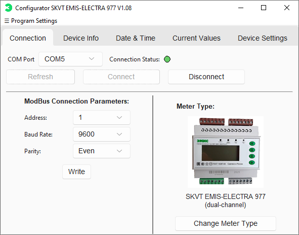
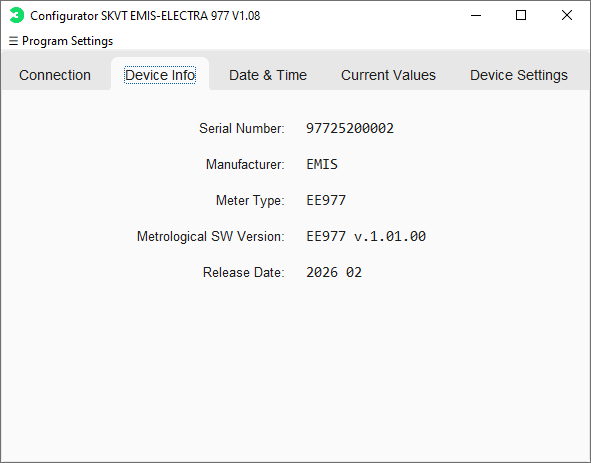
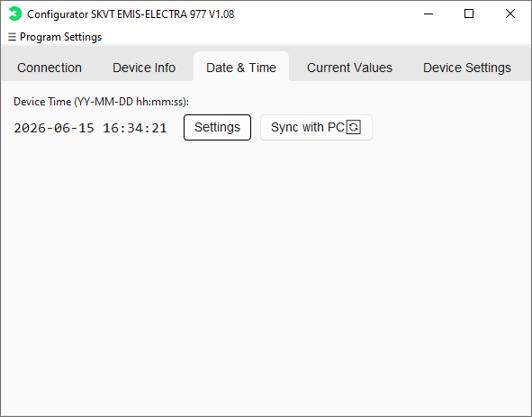
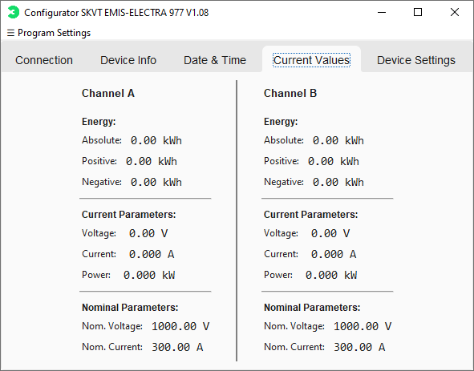
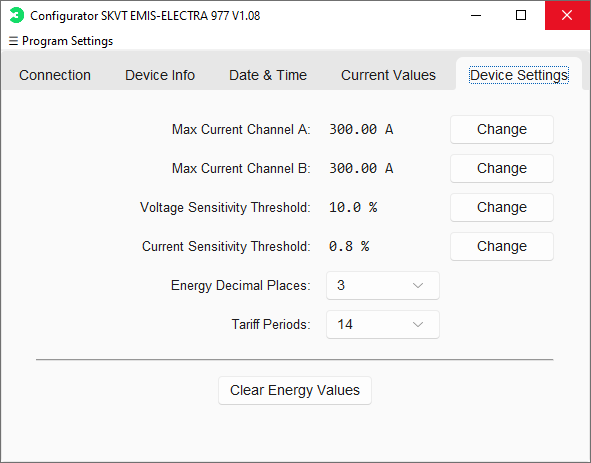

# Smart Meter Configurator
 
Desktop application for configuration, diagnostics, and commissioning of smart electricity meters.
 
## Overview
 
Smart Meter Configurator is a Python-based desktop application designed for field engineers to simplify smart meter setup, diagnostics, and maintenance.
It provides automatic communication parameter detection, real-time monitoring, device configuration, and multilingual support through a streamlined interface optimized for industrial environments.
 
## Key Features
 
### Automatic Communication Parameter Discovery
 
The application can automatically detect:
- Device address
- Baud rate
- Parity settings
 
This allows engineers to establish communication with a meter without prior knowledge of its current communication parameters, significantly reducing commissioning time and setup complexity.
 
### Meter Configuration
 
- Support for single-channel meters
- Support for dual-channel meters
- Modbus communication parameter configuration
- Device address configuration
- Sensitivity adjustment
- Threshold configuration
 
### Time Management
 
- Manual date and time configuration
- Synchronization with PC system time
 
### Real-Time Monitoring
 
- Voltage monitoring
- Current monitoring
- Power monitoring
- Frequency monitoring
- Energy consumption monitoring
 
### Protected Operations
 
- Energy reset functionality
- Password-protected critical operations
 
### Device Support

The application supports specific smart meter models via documented register maps.
New devices can be integrated by implementing their corresponding register maps and communication parameters.
 
### Multilingual Interface
 
- English
- Russian
- Simplified Chinese
 
Designed for easy extension with additional languages.
 
### User Experience
 
- Modern desktop UI
- Visual meter type selection
- Optimized commissioning workflow
- Simplified navigation for field use
 
## Technology Stack
 
- Python
- PyQt
- Modbus RTU
- RS-485 Communication
 
## Project Goals

Reduce commissioning time and eliminate manual communication setup by introducing automatic parameter detection and a structured configuration environment for smart meters.
 
## Current Status
 
✔ Fully Functional
 
✔ Tested on Real Devices
 
✔ Multilingual Interface
 
✔ Ready for Field Use

## 🎥 Demo

Watch the demo video in the [latest release](https://github.com/Sugo174/Smart-electric-meter-configurator/releases/tag/v.1.08).

**Direct download:** [smart-meter-configurator-demo.mp4](https://github.com/Sugo174/Smart-electric-meter-configurator/releases/download/v.1.08/smart-meter-configurator-demo.mp4)

## Media

### Connection

### Device Info

### Date & Time

### Current Values

### Deviсe Settings

