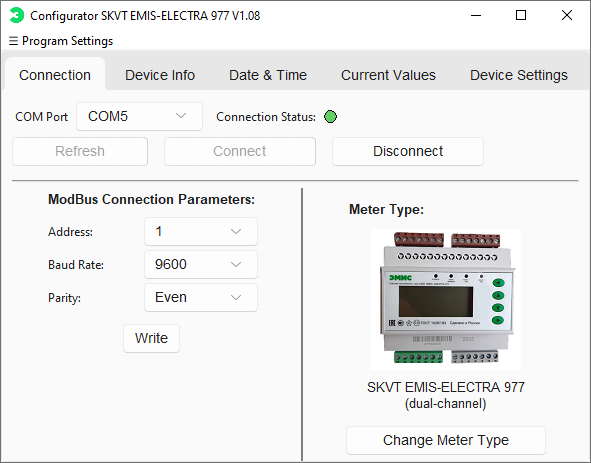
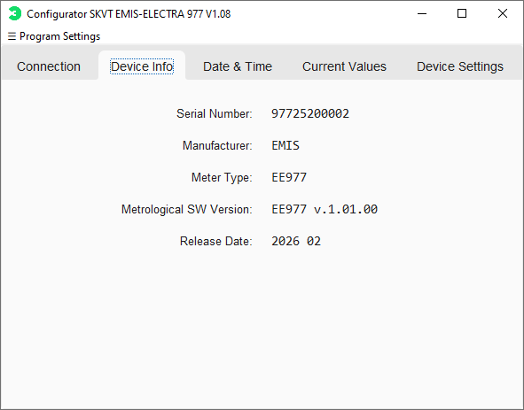
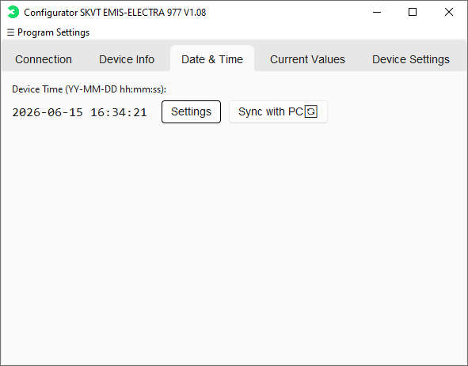
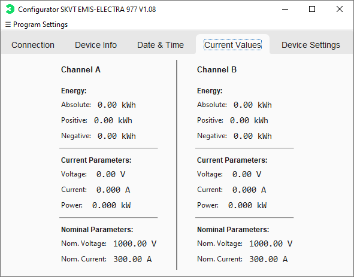
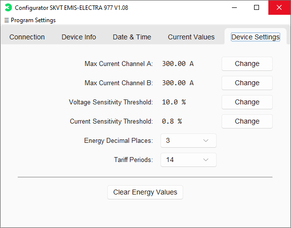

# Smart Meter Configurator
 
Desktop application for configuration, diagnostics, and commissioning of smart electricity meters.

## Table of Contents

- [Overview](#overview)
- [Download and Run](#download-and-run)
- [Key Features](#key-features)
- [Technology Stack](#technology-stack)
- [Project Structure](#project-structure)
- [Project Goals](#project-goals)
- [Current Status](#current-status)
- [Media](#media)
- [License](#license)

## Overview
 
Smart Meter Configurator is a Python-based desktop application designed for field engineers to simplify smart meter setup, diagnostics, and maintenance.
It provides automatic communication parameter detection, real-time monitoring, device configuration, and multilingual support through a streamlined interface optimized for industrial environments.

## Download and Run

### Ready-to-Use Windows Version

1. Download [Smart-Meter-Configurator-v1.08.zip](https://github.com/Sugo174/Smart-electric-meter-configurator/releases/download/v.1.08/Smart-Meter-Configurator-v1.08.zip).
2. Extract the entire archive to a folder.
3. Connect the smart meter through an RS-485 adapter.
4. Run `Smart-Meter-Configurator-v1.08.exe`.

Keep the executable and the `_internal` folder together. Installation of Python is not required for this version.

See the [latest release](https://github.com/Sugo174/Smart-electric-meter-configurator/releases/latest) for available downloads and release notes.

### Running from Source

Requirements:

- Windows
- Python 3.10+
- RS-485 adapter
- Supported smart electricity meter

Clone the repository and install the dependencies:

```bash
git clone https://github.com/Sugo174/Smart-electric-meter-configurator.git
cd Smart-electric-meter-configurator
pip install -r requirements.txt
```

Start the application:

```bash
python gui.py
```

 
## Key Features
 
### Automatic Communication Parameter Discovery
 
The application can automatically detect:
- Device address
- Baud rate
- Parity settings
 
This allows engineers to establish communication with a meter without prior knowledge of its current communication parameters, significantly reducing commissioning time and setup complexity.
 
### Meter Configuration
 
- Support for single-channel meters
- Support for dual-channel meters
- Modbus communication parameter configuration
- Device address configuration
- Sensitivity adjustment
- Threshold configuration
 
### Time Management
 
- Manual date and time configuration
- Synchronization with PC system time
 
### Real-Time Monitoring
 
- Voltage monitoring
- Current monitoring
- Power monitoring
- Frequency monitoring
- Energy consumption monitoring
 
### Protected Operations
 
- Energy reset functionality
- Confirmation code required before clearing stored energy values
- Warning prompt before the reset operation
 
### Supported Devices

The application is designed and tested for EMIS-ELECTRA 977 DC smart electricity meters:

- Single-channel configuration
- Dual-channel configuration
- Modbus RTU communication over RS-485
- Automatic detection of device address, baud rate, and parity

The automatic scan checks Modbus addresses from `1` to `10` and the following baud rates:

- 1200
- 2400
- 4800
- 9600
- 19200

Support for other meter models is not guaranteed. Additional devices require compatible register maps and corresponding changes to the communication logic.

### Operational Safety

The application can write configuration parameters directly to the connected meter.

- Verify the selected meter type before changing any settings.
- Follow the meter manufacturer's wiring and operating instructions.
- Do not disconnect the meter or RS-485 adapter while parameters are being written.
- Energy reset permanently clears stored energy values and requires confirmation.
 
### Multilingual Interface
 
- English
- Russian
- Simplified Chinese
 
Designed for easy extension with additional languages.
 
### User Experience
 
- Modern desktop UI
- Visual meter type selection
- Optimized commissioning workflow
- Simplified navigation for field use
 
## Technology Stack
 
- Python
- Tkinter
- sv_ttk
- Modbus RTU
- RS-485 Communication

## Project Structure

- `gui.py` — Application entry point and graphical user interface.
- `device.py` — Modbus RTU communication and meter operations.
- `constants.py` — Register addresses, communication parameters, and shared constants.
- `requirements.txt` — Python dependencies required to run the source code.
- `CHANGELOG.md` — Version history and notable changes.
- `icons/` — Interface icons.
- `images/` — Smart meter images used by the application.
- `assets/screenshots/` — Screenshots displayed in this README.
- `assets/video/` — Demonstration video.
- `LICENSE` — MIT License terms.
 
## Project Goals

Reduce commissioning time and eliminate manual communication setup by introducing automatic parameter detection and a structured configuration environment for smart meters.
 
## Current Status
 
✔ Fully Functional
 
✔ Tested on Real Devices
 
✔ Multilingual Interface
 
✔ Ready for Field Use

## Media

## Demo video

Watch the demonstration in the [latest release](https://github.com/Sugo174/Smart-electric-meter-configurator/releases/latest).

**Direct download:** [smart-meter-configurator-demo.mp4](https://github.com/Sugo174/Smart-electric-meter-configurator/releases/download/v.1.08/smart-meter-configurator-demo.mp4)

## Screenshots

#### Connection



#### Device Information



#### Date and Time



#### Current Values



#### Device Settings



## License

This project is licensed under the MIT License. See the [LICENSE](LICENSE) file for details.
